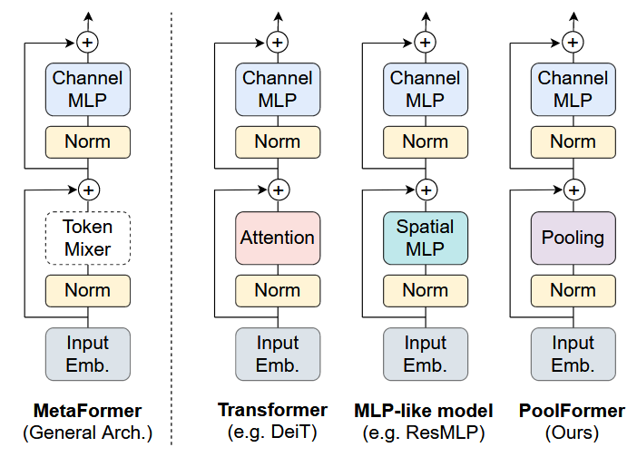

# CVPR 2022 MetaFormer Is Actually What You Need for Vision

阅读时间：20240920

## Motivation
看图就能知道在干啥的论文，将Transformer抽象为MetaFormer，替换token mixer module来验证效果

## Idea
跑了一下代码，可以上手当backbone用，图像分类、目标检测、实例分割和语义分割都能用。数据集：ImageNet、COCO、ADE20K