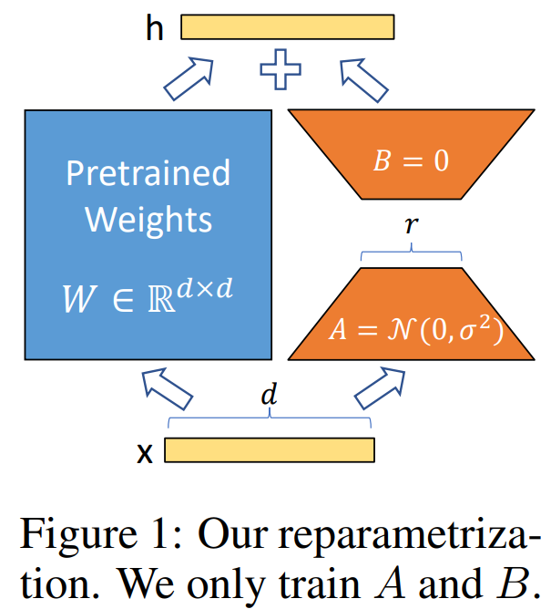

# LoRA: Low-rank adaptation of large language models
阅读时间：0921

## Motivation
低秩分解（Low-Rank Decomposition）算法，训练参数仅为整体参数的万分之一、GPU显存使用量减少2/3且不会引入额外的推理耗时。大模型良好的few-shot能力哪儿来的？instrisic dimension参数。用一个低秩分解来表示参数更新。

## Idea
低资源微调大模型，估算要用多少显卡资源（之前微调7B模型需要3×28G的显存(SGD+Momentum)，至少需要2张A100的显卡），降低三倍硬件条件。