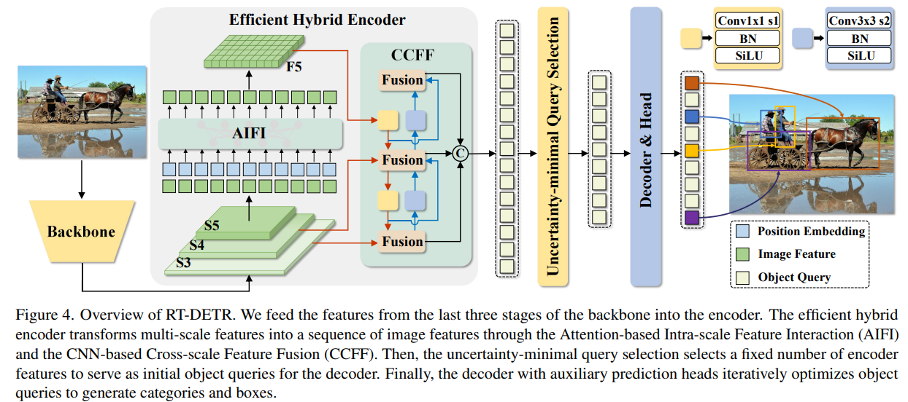

# DETRs beat YOLOs on real-time object detection

阅读时间：0919

## Motivation
实时端到端，避免后处理NMS的推理延迟。本文：降低DETR的高计算成本。1.混合编码器：分离同一尺度上的交互和跨尺度的融合。2.不确定性最小化的查询选择。3.使用不同的解码器层来灵活地调整模型大小和推理速度。

## Idea
另一条路，重视实时性，但还是拼不过yolo