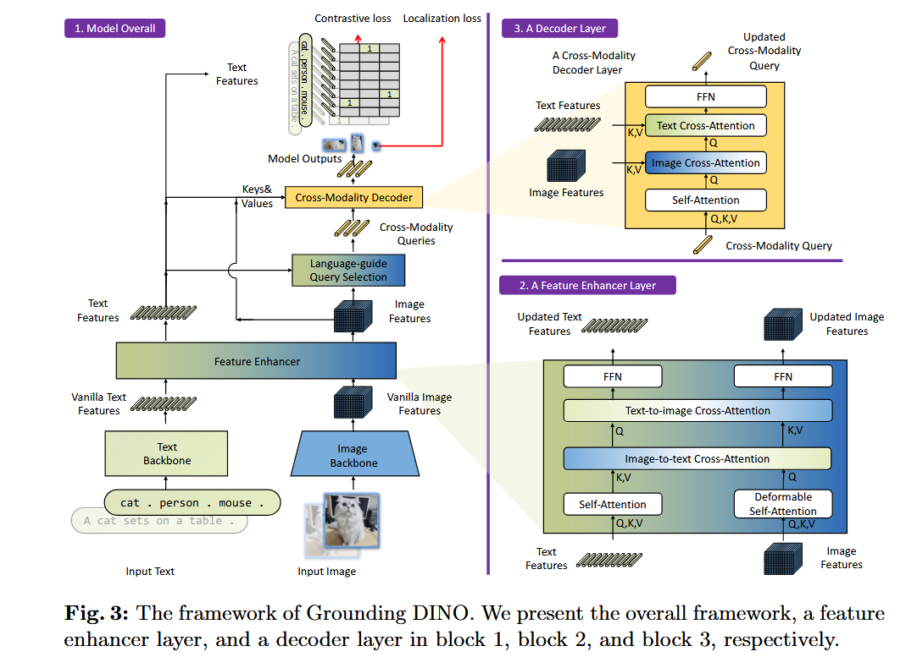

# Grounding DINO Marrying DINO with Grounded Pre-Training for Open-Set Object Detection
阅读时间：10.23

## Motivation
#### 概念
- Open-set Object Detection 图+描述->box+类别
- Referring（CLIP-based） 用CLIP转每一个类别标签（句子）与视觉特征求相似度
- Grounding (visual language领域) 图像中的特定区域与文本描述或语义标签对齐 图+描述->box
- 1.Referring Expression Comprehension（REC）图+句子->一个物体
- 2.phrase Grounding 图+句子->多个物体
- phrase Extraction and Grounding 图+句子->多个物体

#### 方法
- 所有类名连接成一句话，要求输入的句子就有了
- grounding词表类别不受限制，image-test pairs 打伪标签循环训练（得看看实验）
- 三个阶段都搞融合

#### 问题
- 开放集目标检测和visual grounding（VG）根据自然语言查询在图像中定位对象的区别？grounding这个任务不是本来就检测了吗，为啥要和detection结合，是缺了检测头？
- sub-sentence level text features.为什么能解决全类名的干扰信息，怎么做到注意力masks掉无用的

## Idea
- 加CLIP的方式感觉像度量学习
- 去看GLIP
