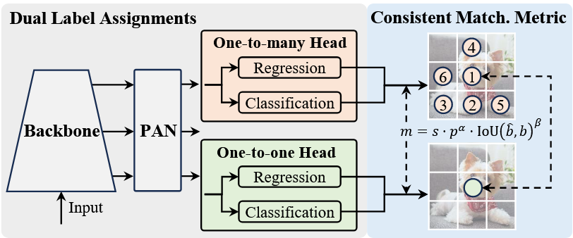

# YOLOv10: Real-Time End-to-End Object Detection

阅读时间：0929

## Motivation
v8基础上改进，消除非最大抑制（NMS）来优化速度。怎么做的？训练阶段两条路：对 One-to-many Head 和 One-to-one Head 两个头的输出都计算损失，拉近两个分支；推理阶段仅用 One-to-one Head 不用 NMS。这种做法之前没人想到吗？感觉挺常见的。其他：轻量级分类头、空间通道解耦下采样和大内核卷积等

## Idea
刚看完yolov11就出了

