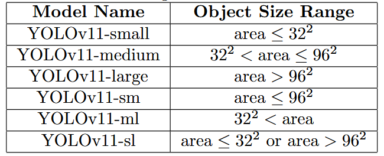

# YOLOv11 Optimization for Efficient Resource Utilization
阅读时间：20241223

## Motivation
去掉不必要的结构，computational resource efficiency
YOLOv11-small, YOLOv11-medium, YOLOv11-large, YOLOv11-sm , YOLOv11-ml, and YOLOv11-sl.对各种尺寸目标的适配

## Idea
为啥里边的结构是那样连接的？
各种数据集的数据增强怎么做的
忽大忽小、原版可能更有效，分数据集处理